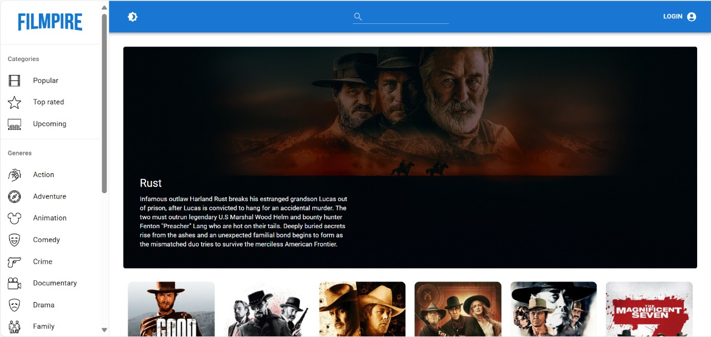
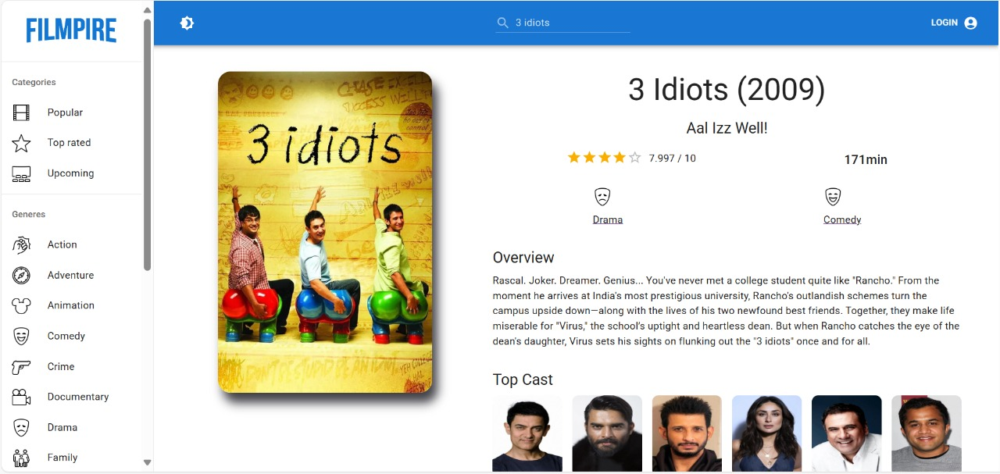

# 🎬 FlixHub - Explore Trending Movies & TV Shows

FlixHub is a sleek and powerful React-based frontend application that allows users to browse, search, and explore movies and TV shows using The Movie Database (TMDB) API. It features a beautiful UI, dark/light theme toggle, voice command integration (Alan AI), and category-based filtering.

---

## 🧰 Features

- 🎞️ Browse popular, top-rated, upcoming, and now-playing movies
- 🔍 Search movies by keyword
- 🗂️ Filter by genre or category
- 🌓 Toggle between Light and Dark modes
- 🗣️ Voice commands powered by Alan AI
- 🎥 View detailed information on each movie
- 📱 Fully responsive UI for mobile and desktop


## 🚀 Live Demo

🔗 [Visit the Live Site](https://your-vercel-deployment-link.vercel.app)

---

## 🛠️ Tech Stack

| Category   | Technology                           |
|------------|---------------------------------------|
| Frontend   | React.js, Material UI                |
| State Mgmt | Redux Toolkit                        |
| Voice AI   | Alan AI SDK                          |
| API        | The Movie Database (TMDB) API        |
| Hosting    | Vercel                               |

---


## Setup Instructions

1. Clone the repository
```bash
git clone https://github.com/radhikajindal13/flixhub.git
```

2. Navigate to project directory
```bash
cd flixhub
```

3. Install dependencies
```bash
npm install
```

4. Add Environment Variable
Create a .env file in the root directory and add:
```
REACT_APP_TMDB_API_KEY=your_tmdb_api_key_here
```

5. Start the development server
```bash
npm start
```


## 👩‍💻 Author

**Radhika Jindal**  
🔗 [GitHub](https://github.com/radhikajindal13)  
🔗 [LinkedIn](https://www.linkedin.com/in/radhika-jindal-1b5a7a258/)


## 🖼️ Screenshots

| Home Page | Movie Info Page |
|-----------|------------------|
|  |  |

---


